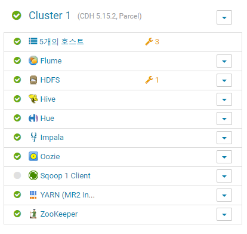

# SK C&C Big Data Knowledge Test (Part1) 

## 들어가기 전: Students 16
```
ssh -i skcc.pem centos@54.180.168.23
ssh -i skcc.pem centos@54.180.171.31
ssh -i skcc.pem centos@54.180.180.14
ssh -i skcc.pem centos@54.180.182.139
ssh -i skcc.pem centos@54.180.188.90
```

## Create a CDH Cluster on AWS
### a. Linux setup
```
sudo passwd centos
>> centos

sudo vi /etc/ssh/sshd_config
>> PasswordAuthentication yes

sudo systemctl restart sshd.service

-- Setup /etc/hosts with the following information for each of the 5 hosts
sudo vi /etc/hosts

172.31.8.250    master01.cdhcluster.com mn1
172.31.6.3      util01.cdhcluster.com   util01
172.31.10.139   data01.cdhcluster.com   dn1
172.31.14.43    data02.cdhcluster.com   dn2
172.31.9.121    data03.cdhcluster.com   dn3

sudo hostnamectl set-hostname master01.cdhcluster.com
sudo hostnamectl set-hostname util01.cdhcluster.com
sudo hostnamectl set-hostname data01.cdhcluster.com
sudo hostnamectl set-hostname data02.cdhcluster.com
sudo hostnamectl set-hostname data03.cdhcluster.com
hostname -f

init 6

-- ssh-keygen (util01만)
cd .ssh
ssh-keygen -t rsa

ssh-copy-id -i ~/.ssh/id_rsa.pub mn1
ssh-copy-id -i ~/.ssh/id_rsa.pub dn1
ssh-copy-id -i ~/.ssh/id_rsa.pub dn2
ssh-copy-id -i ~/.ssh/id_rsa.pub dn3


-- 모든 host에 아래 계정 생성
cat /etc/passwd | grep training
cat /etc/group | grep skcc

sudo useradd training
sudo passwd training
sudo groupadd skcc

sudo usermod -aG wheel training
sudo usermod -aG skcc training

getent group wheel
getent group skcc
getent passwd training
```

###  b. Install a MySQL server & c. Install Cludera Manager
```
-- Configure the repository for CM 5.15.2
sudo yum install -y wget
sudo wget https://archive.cloudera.com/cm5/redhat/7/x86_64/cm/cloudera-manager.repo \
-P /etc/yum.repos.d/

sudo vi /etc/yum.repos.d/cloudera-manager.repo
>> baseurl=https://archive.cloudera.com/cm5/redhat/6/x86_64/cm/5.15.2/

sudo rpm --import \
https://archive.cloudera.com/cm5/redhat/7/x86_64/cm/RPM-GPG-KEY-cloudera

sudo yum install oracle-j2sdk1.7

-- Install CM
sudo yum install -y cloudera-manager-daemons cloudera-manager-server

-- Install and enable Maria DB (or a DB of your choice)
sudo yum install -y mariadb-server
sudo systemctl enable mariadb
sudo systemctl start mariadb
sudo /usr/bin/mysql_secure_installation

-- Install the mysql connector or mariadb connector
sudo yum install -y wget
sudo wget https://dev.mysql.com/get/Downloads/Connector-J/mysql-connector-java-5.1.47.tar.gz

tar zxvf mysql-connector-java-5.1.47.tar.gz
sudo mkdir -p /usr/share/java/
cd mysql-connector-java-5.1.47
sudo cp mysql-connector-java-5.1.47-bin.jar /usr/share/java/mysql-connector-java.jar
cd /usr/share/java/
sudo yum install mysql-connector-java

-- DB 관련 정보 확인
hostname
>> util01.cdhcluster.com

mysql --version
>> mysql  Ver 15.1 Distrib 5.5.60-MariaDB, for Linux (x86_64) using readline 5.1

mysql -u root -p
show databases;
>>
+--------------------+
| Database           |
+--------------------+
| information_schema |
| mysql              |
| performance_schema |
+--------------------+
3 rows in set (0.00 sec)

-- Create the databases and users in MariaDB
mysql -u root -p

CREATE DATABASE scm DEFAULT CHARACTER SET utf8 DEFAULT COLLATE utf8_general_ci;
GRANT ALL ON scm.* TO 'scm-user'@'%' IDENTIFIED BY 'somepassword';

CREATE DATABASE amon DEFAULT CHARACTER SET utf8 DEFAULT COLLATE utf8_general_ci;
GRANT ALL ON amon.* TO 'amon-user'@'%' IDENTIFIED BY 'somepassword';

CREATE DATABASE rmon DEFAULT CHARACTER SET utf8 DEFAULT COLLATE utf8_general_ci;
GRANT ALL ON rmon.* TO 'rmon-user'@'%' IDENTIFIED BY 'somepassword';

CREATE DATABASE hue DEFAULT CHARACTER SET utf8 DEFAULT COLLATE utf8_general_ci;
GRANT ALL ON hue.* TO 'hue-user'@'%' IDENTIFIED BY 'somepassword';

CREATE DATABASE metastore DEFAULT CHARACTER SET utf8 DEFAULT COLLATE utf8_general_ci;
GRANT ALL ON metastore.* TO 'metastore-user'@'%' IDENTIFIED BY 'somepassword';

CREATE DATABASE sentry DEFAULT CHARACTER SET utf8 DEFAULT COLLATE utf8_general_ci;
GRANT ALL ON sentry.* TO 'sentry-user'@'%' IDENTIFIED BY 'somepassword';

CREATE DATABASE oozie DEFAULT CHARACTER SET utf8 DEFAULT COLLATE utf8_general_ci;
GRANT ALL ON oozie.* TO 'oozie-user'@'%' IDENTIFIED BY 'somepassword';

FLUSH PRIVILEGES;
SHOW DATABASES;
EXIT;

-- Setup the CM database
sudo /usr/share/cmf/schema/scm_prepare_database.sh mysql scm scm-user somepassword
sudo rm /etc/cloudera-scm-server/db.mgmt.properties
sudo systemctl start cloudera-scm-server
```

### -- CM 접속
http://54.180.171.31:7180/cmf/login
>> admin / admin

### -- 클러스터에 아래 서비스 설치
1. HDFS
2. YARN
3. Sqoop
4. Hive
5. Impala
6. HUE (Oozie도 선설치 필요)


